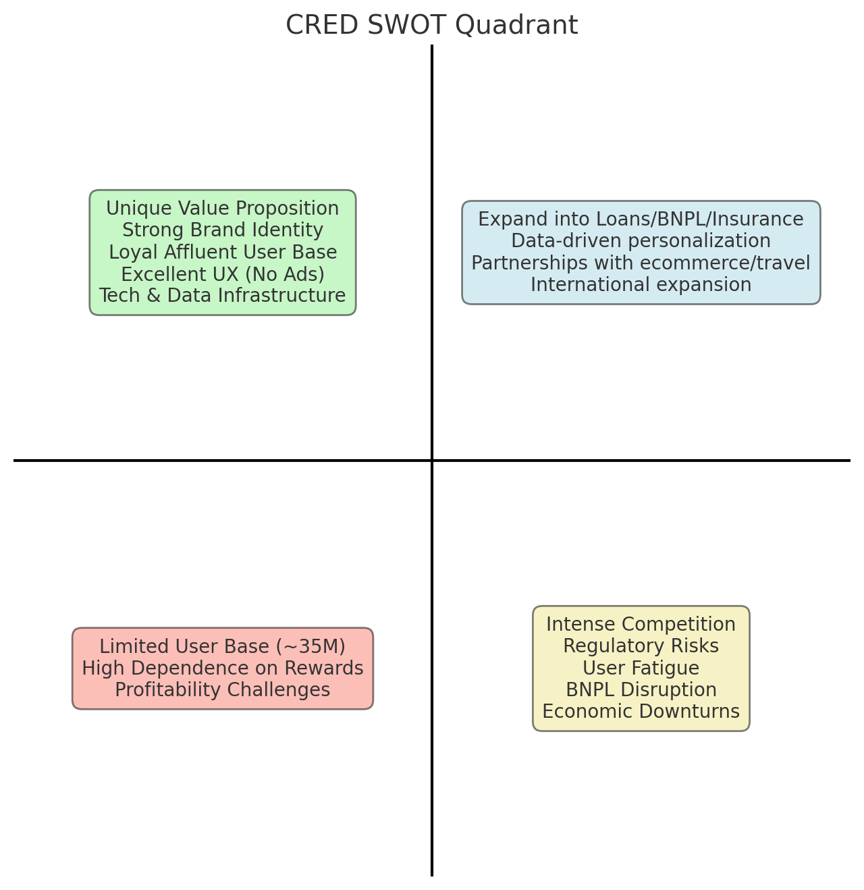

# CRED SWOT Analysis — Data Notebook

This repository contains a reproducible data notebook that structures and visualizes a SWOT analysis of **CRED** (the Indian fintech startup).

## What’s inside
- `cred_swot_analysis.ipynb` — a Jupyter notebook with:
  - Structured SWOT tables from the PPT
  - A quadrant chart visualizing Strengths, Weaknesses, Opportunities, and Threats
  - Key highlights and contextual notes
- `src/helpers.py` — helper functions to render SWOT tables and quadrant plots
- `requirements.txt` — Python packages to run the notebook
- `.github/workflows/ci.yml` — GitHub Actions workflow to test notebook execution
- `LICENSE` — MIT license

## Preview

### SWOT Quadrant


## How to run
1. Install dependencies:
   ```bash
   pip install -r requirements.txt
   ```
2. Launch Jupyter and open the notebook:
   ```bash
   jupyter notebook cred_swot_analysis.ipynb
   ```

## License
MIT
